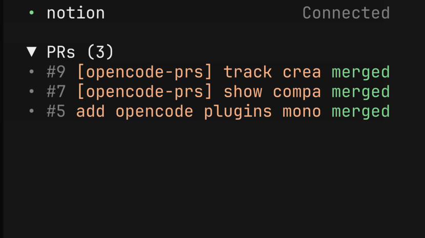

# opencode-prs

[OpenCode](https://opencode.ai) TUI plugin that lists GitHub pull requests opened by the current session.



The sidebar section is collapsible. Each compact row links to GitHub and shows whether the pull request is draft, open, or merged. Hover a clipped title to scroll through its full text.

## Install

OpenCode 2, in `~/.config/opencode/cli.json`:

```json
{ "plugins": ["opencode-prs"] }
```

OpenCode 1, in `~/.config/opencode/tui.json`:

```json
{ "plugin": ["opencode-prs"] }
```

Then restart OpenCode. The plugin requires an installed and authenticated [GitHub CLI](https://cli.github.com/).

## How it works

The plugin finds successful `gh pr create` calls made by the session. It asks `gh` for the current title and state. Closed pull requests are hidden, while merged pull requests remain visible. The sidebar shows the five most recently opened pull requests.

Results are cached by session. Switching tabs shows the previous result immediately and revalidates GitHub data in the background.

One published package supports OpenCode 1 and OpenCode 2.

## Development

```sh
pnpm typecheck
pnpm test
```
